# 🎓 UniTrack - Unified Educational Management Platform

<div align="center">
  
  
  <h3>Transform Education with Intelligent Management</h3>
  
  [](LICENSE)
  [](https://dotnet.microsoft.com/)
  [](https://vuejs.org/)
  [](https://www.docker.com/)
  [](https://www.typescriptlang.org/)
  
  [Features](#-key-features) • [Demo](#-live-demo) • [Documentation](https://spasmilenkov.github.io/UniTrackDocs/) • [Quick Start](#-quick-start) • [Architecture](#-architecture)
</div>

---

## 🌟 Overview

UniTrack is a comprehensive educational management platform that revolutionizes how schools and universities operate. Built with modern web technologies and powered by artificial intelligence, it provides a unified digital ecosystem for students, teachers, parents, and administrators.

### 🎯 Why UniTrack?

- **📊 AI-Powered Analytics** - Get intelligent insights and predictions about student performance
- **🏫 Multi-Institutional** - Manage multiple schools or universities from a single platform
- **📱 Progressive Web App** - Works seamlessly on any device with offline capabilities
- **🔐 Enterprise Security** - JWT authentication with role-based access control
- **🌍 Multilingual** - Built-in support for multiple languages (EN/BG)
- **⚡ Real-time Updates** - Instant messaging and live notifications

---

## 📸 Platform Showcase

### 🏛️ Administrative Control Center
<table>
  <tr>
    <td>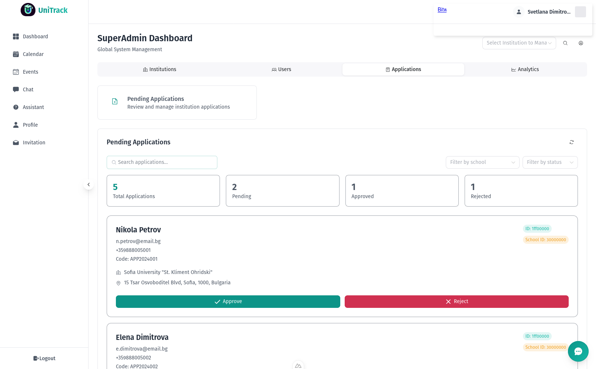</td>
    <td>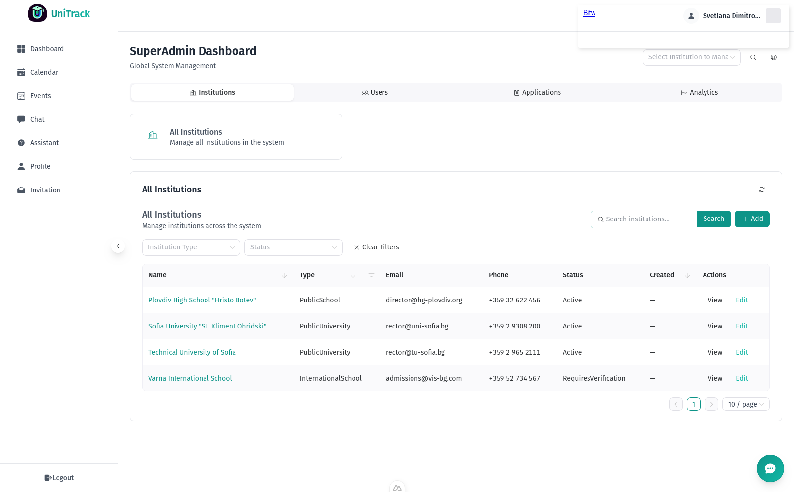</td>
  </tr>
  <tr>
    <td align="center"><b>Super Admin Dashboard</b><br/>Complete system oversight with institution management</td>
    <td align="center"><b>Application Review System</b><br/>Streamlined approval workflow for new registrations</td>
  </tr>
</table>

<table>
  <tr>
    <td>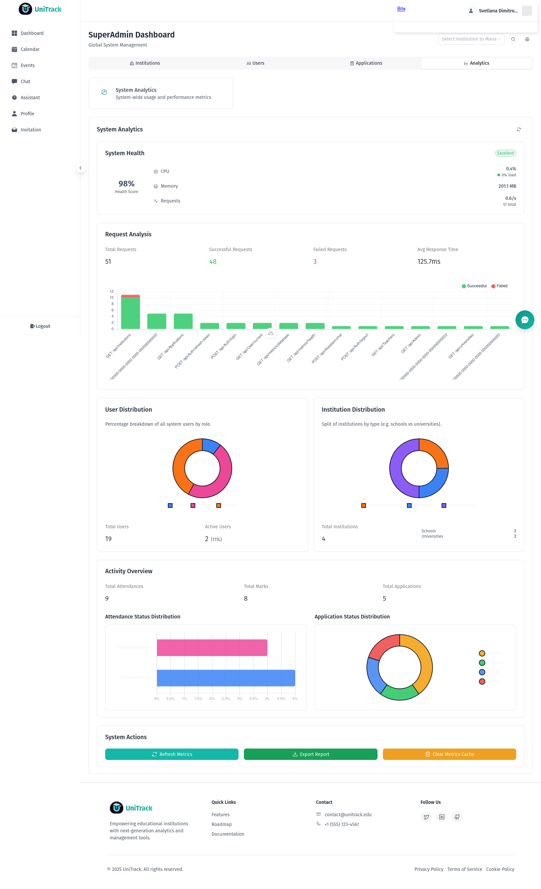</td>
    <td>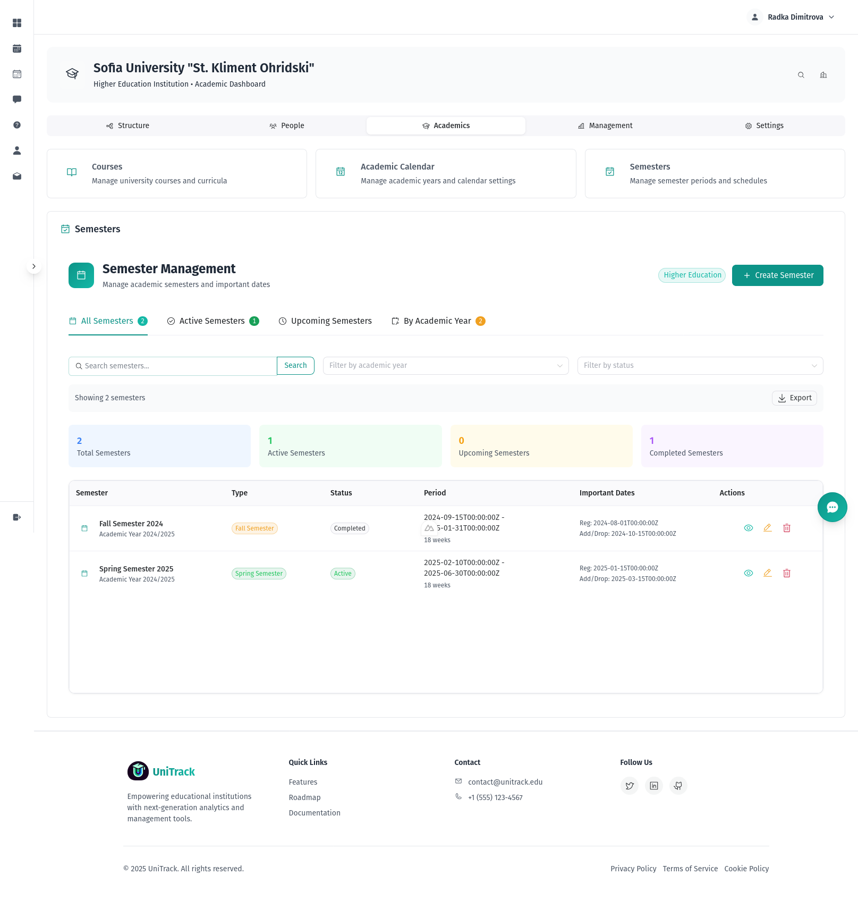</td>
  </tr>
  <tr>
    <td align="center"><b>System Performance Metrics</b><br/>Real-time monitoring and health checks</td>
    <td align="center"><b>Institution Admin Panel</b><br/>School-specific administrative controls</td>
  </tr>
</table>

### 📊 Analytics & Intelligence
<table>
  <tr>
    <td>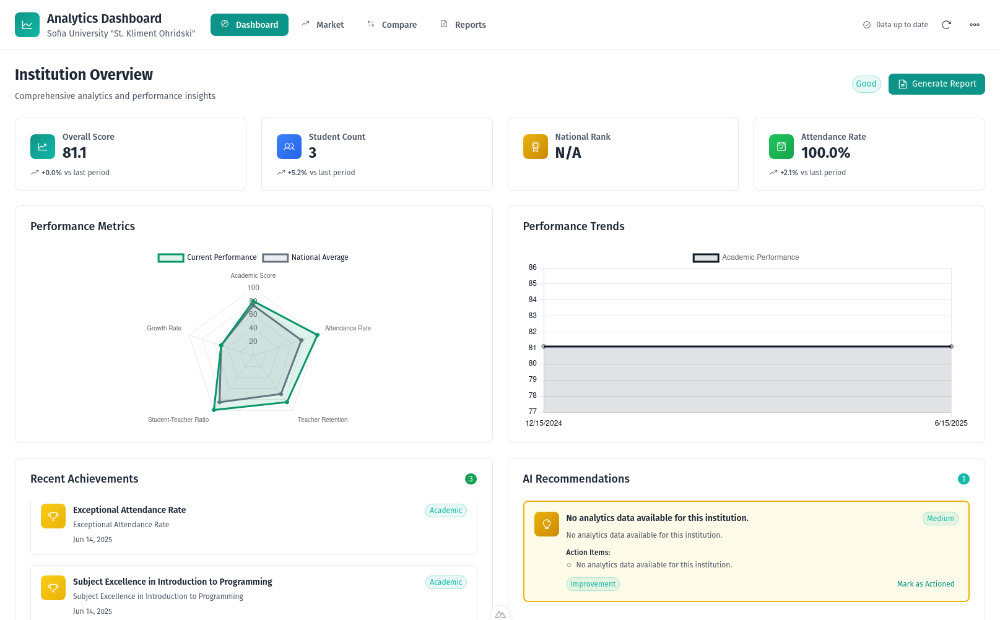</td>
    <td>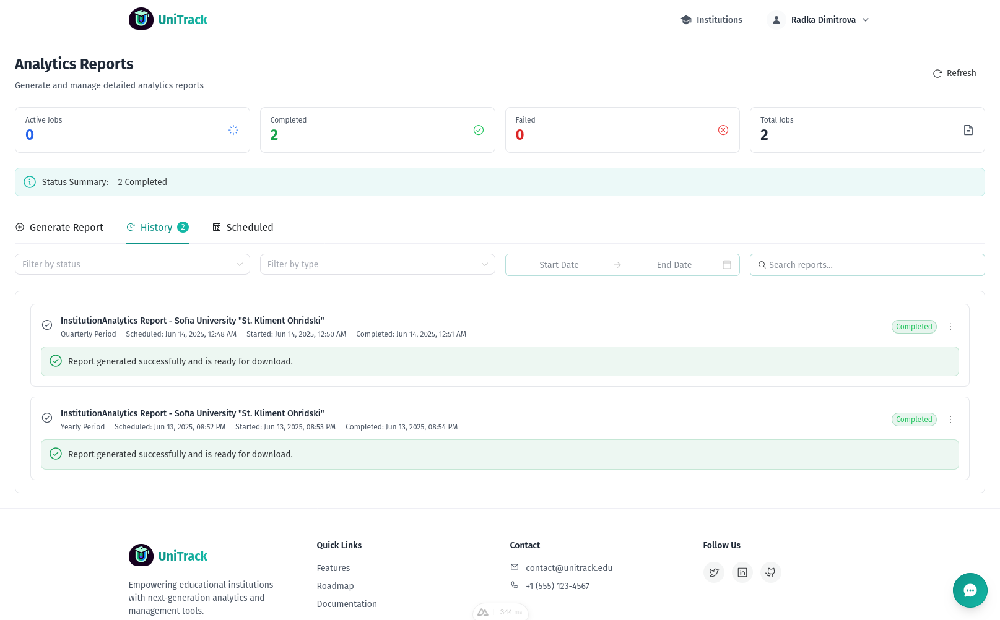</td>
  </tr>
  <tr>
    <td align="center"><b>Interactive Analytics Dashboard</b><br/>Real-time performance metrics and KPIs</td>
    <td align="center"><b>Analytics Report Management</b><br/>Generate and schedule automated reports</td>
  </tr>
</table>

<table>
  <tr>
    <td colspan="2" align="center">
      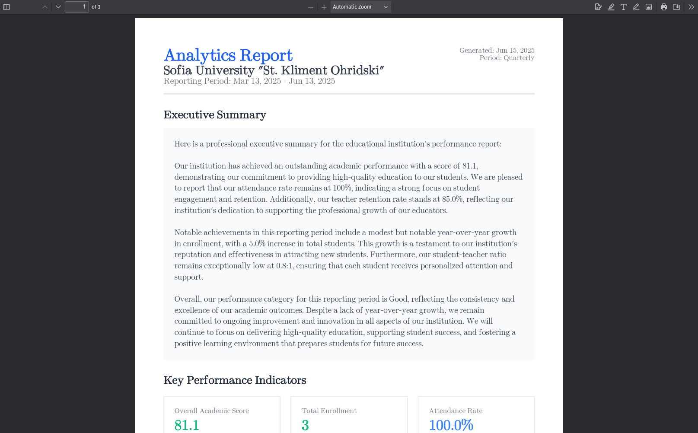
    </td>
  </tr>
  <tr>
    <td colspan="2" align="center"><b>AI-Generated PDF Reports</b><br/>Professional reports with intelligent insights and executive summaries</td>
  </tr>
</table>

### 👥 User Experience & Dashboards
<table>
  <tr>
    <td>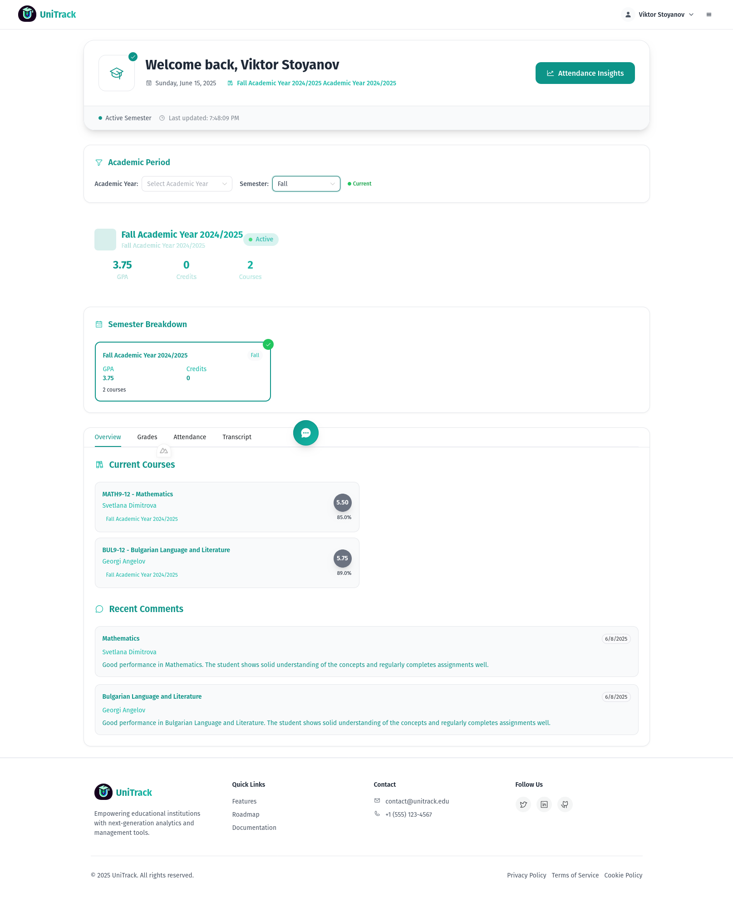</td>
    <td>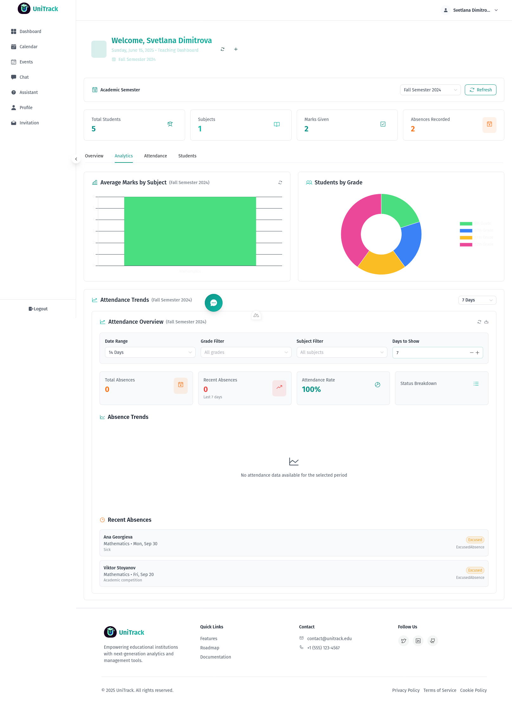</td>
  </tr>
  <tr>
    <td align="center"><b>Student Dashboard</b><br/>Personalized academic overview and progress tracking</td>
    <td align="center"><b>Teacher Grade Management</b><br/>Efficient grading interface with analytics</td>
  </tr>
</table>

### 📚 Academic Management
<table>
  <tr>
    <td>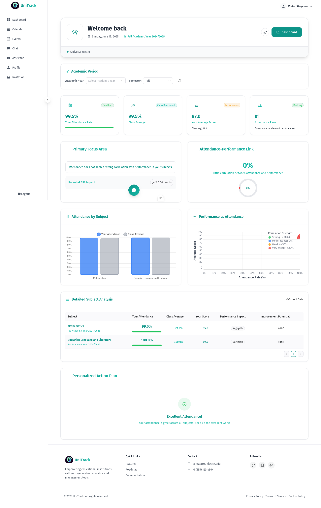</td>
    <td>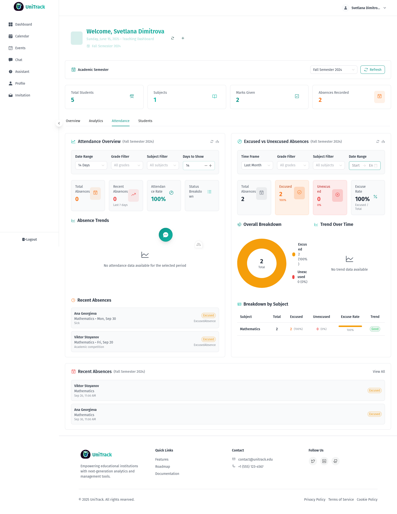</td>
  </tr>
  <tr>
    <td align="center"><b>Student Attendance View</b><br/>Track and manage student attendance records</td>
    <td align="center"><b>Teacher Attendance Management</b><br/>Comprehensive absence tracking and reporting</td>
  </tr>
</table>

### 💬 Communication & Collaboration
<table>
  <tr>
    <td>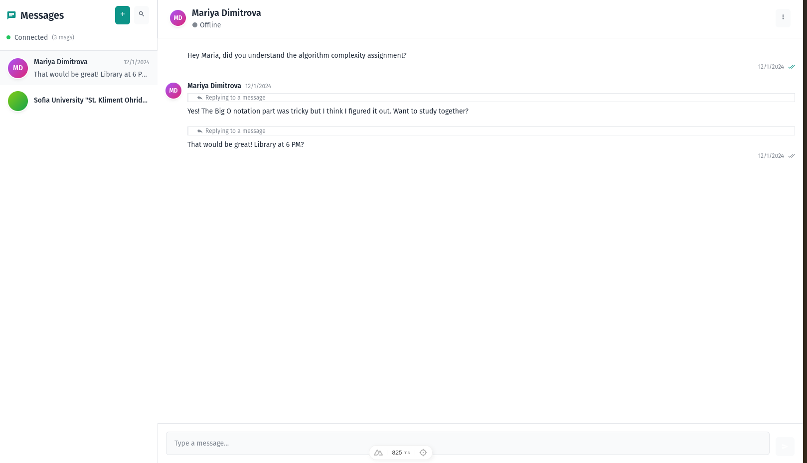</td>
    <td>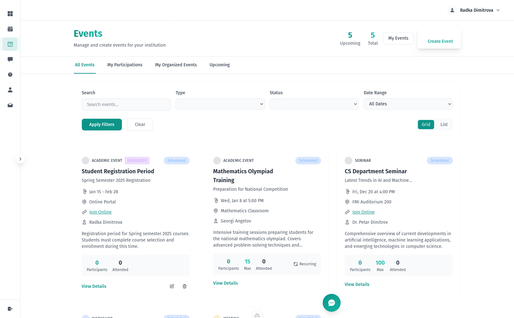</td>
  </tr>
  <tr>
    <td align="center"><b>Integrated Messaging System</b><br/>Real-time chat with file sharing capabilities</td>
    <td align="center"><b>Event Management Platform</b><br/>Organize and track academic and social events</td>
  </tr>
</table>

### 🤖 AI Assistant & Smart Features
<table>
  <tr>
    <td>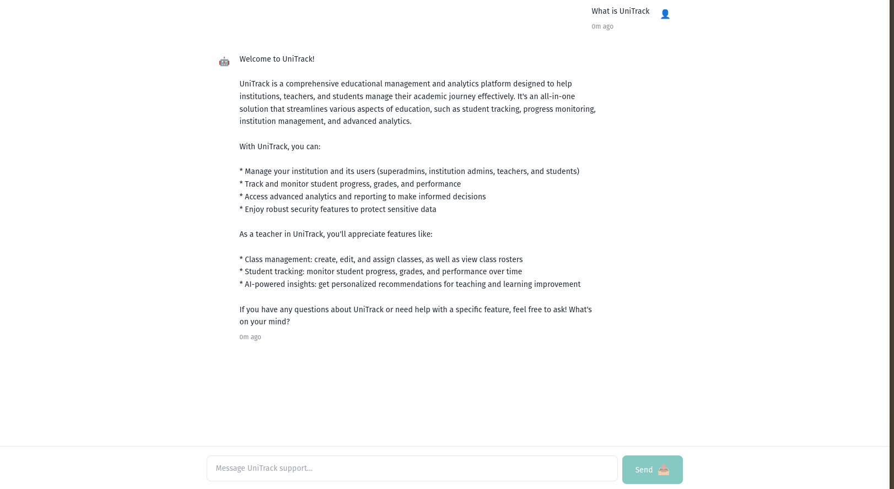</td>
    <td>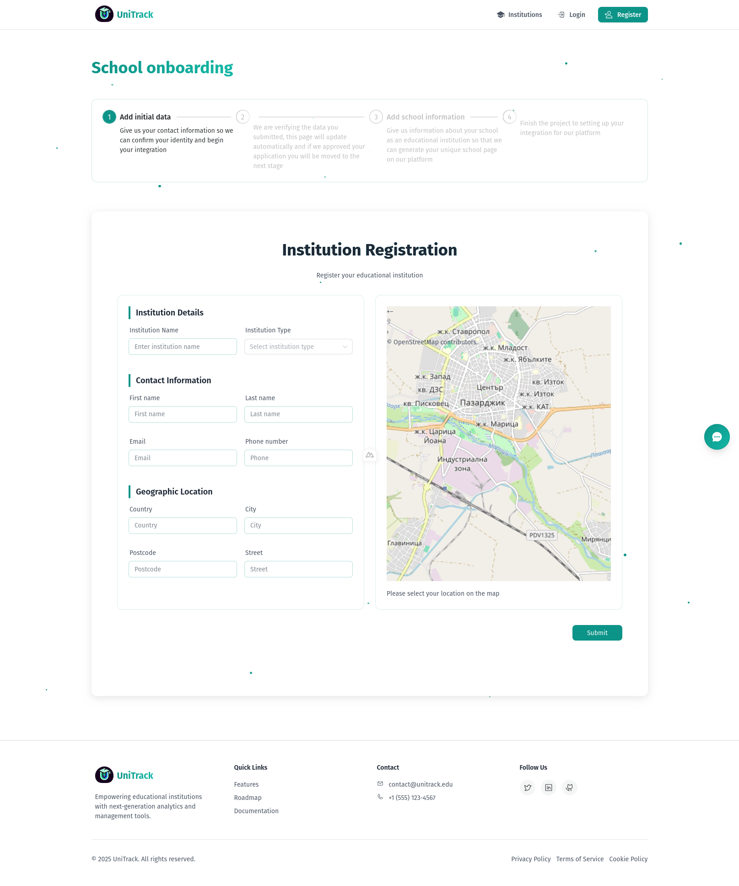</td>
  </tr>
  <tr>
    <td align="center"><b>AI-Powered Assistant</b><br/>Intelligent help and personalized recommendations</td>
    <td align="center"><b>Streamlined Registration</b><br/>Smart onboarding with step-by-step guidance</td>
  </tr>
</table>

---

## ✨ Key Features

### 👥 **Comprehensive User Management**
- **Multi-Role System**: Students, Teachers, Parents, Admins, and Super Admins
- **Flexible Permissions**: Granular role-based access control
- **Multi-Institution Support**: Users can belong to multiple schools/universities
- **Streamlined Onboarding**: Step-by-step registration with approval workflow

### 📚 **Academic Excellence Tools**
- **Dynamic Structure**: Support for K-12 schools and universities
- **Flexible Curriculum**: Core subjects and elective management
- **Multiple Grading Systems**: Bulgarian (2-6), American (GPA), European (ECTS)
- **Smart Scheduling**: Academic calendar with semester management

### 📊 **AI-Powered Analytics**
```
🤖 Intelligent Features:
• Predictive Performance Modeling
• Early Risk Detection for At-Risk Students
• Personalized Learning Recommendations
• Automated Executive Summaries
• Comparative Market Analysis
• Natural Language Processing for Reports
• Trend Analysis and Forecasting
```

### 💬 **Real-time Communication Hub**
- **Instant Messaging**: Direct and group chat with file sharing
- **Smart Notifications**: Automated alerts for grades, attendance, and events
- **Event Coordination**: Academic, social, and sports event management
- **Parent Portal**: Real-time updates on student progress
- **AI Assistant**: 24/7 intelligent support for all users

### 📈 **Advanced Reporting System**
- **Automated PDF Generation**: Professional reports with AI insights
- **Custom Dashboards**: Role-specific KPI tracking
- **Market Intelligence**: Cross-institutional comparisons
- **Scheduled Reports**: Automated periodic report delivery
- **Export Capabilities**: Export your ai generated insights in PDF format

### 🎯 **Smart Academic Management**
- **Intelligent Attendance Tracking**: Pattern recognition and alerts
- **Grade Analytics**: Performance trends and predictions
- **Resource Optimization**: AI-driven scheduling recommendations
- **Compliance Monitoring**: Automatic regulatory compliance checks

---

## 🏗️ Architecture

UniTrack is built on a modern microservices architecture with 8 interconnected services:

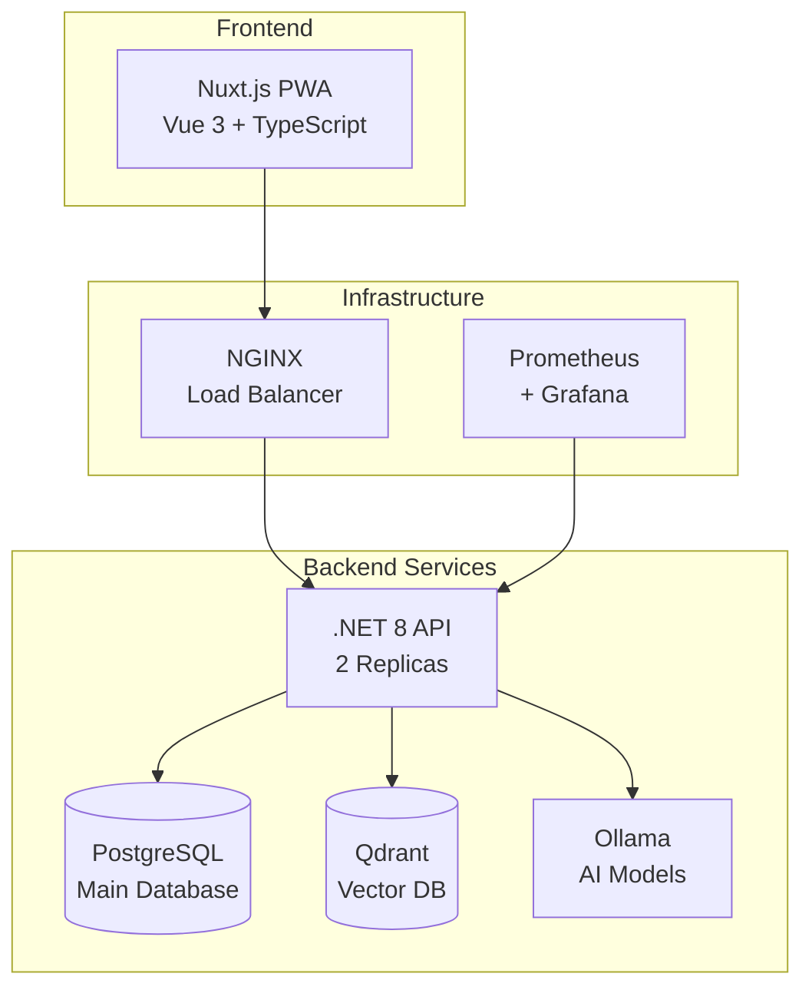
```mermaid
graph TB
    subgraph "Frontend"
        UI[Nuxt.js PWA<br/>Vue 3 + TypeScript]
    end
    
    subgraph "Backend Services"
        API[.NET 8 API<br/>2 Replicas]
        DB[(PostgreSQL<br/>Main Database)]
        VDB[(Qdrant<br/>Vector DB)]
        AI[Ollama<br/>AI Models]
    end
    
    subgraph "Infrastructure"
        LB[NGINX<br/>Load Balancer]
        MON[Prometheus<br/>+ Grafana]
    end
    
    UI --> LB
    LB --> API
    API --> DB
    API --> VDB
    API --> AI
    MON --> API
```

### 🛠️ Technology Stack

| Layer | Technology | Purpose |
|-------|------------|---------|
| **Frontend** | Nuxt 3, Vue 3, TypeScript | Progressive Web Application |
| **UI Components** | Naive UI, Tailwind CSS | Modern, responsive interface |
| **Backend** | ASP.NET Core 8 | RESTful API with SignalR |
| **Database** | PostgreSQL | Primary data storage |
| **Vector Database** | Qdrant | AI/ML embeddings storage |
| **AI/ML** | Ollama (Llama 3.2) | Local language model inference |
| **Caching** | Redis (in-memory) | Performance optimization |
| **File Storage** | Firebase Cloud Storage | Document and media storage |
| **Monitoring** | Prometheus + Grafana | System observability |

### 📊 Database Architecture

The system uses **51 database tables** organized into 5 main functional areas:

1. **User & Identity Management** (16 tables)
2. **Academic Structure** (18 tables)
3. **Performance Tracking** (6 tables)
4. **Communication** (7 tables)
5. **Analytics & Reporting** (4 tables)

---

## 🚀 Quick Start

### Prerequisites

- Docker & Docker Compose (v20.10+)
- 16GB RAM (recommended for AI features since they are hosted locally)
- 20GB free disk space (Solely depends on the model, the current config uses ollama 3.2, heavier models require more space)
- API project setup on Google cloud console for GMAIL to use IMAP (**Mandatory**)
- Firebase project setup to use storage (**Mandatory**, project cannot function without it) ⚠️
- Credentials for Mail trap (**Mandatory**, project requires the sending of emails for vital parts of the workflow) ⚠️

---

## 🌟 Use Cases

### 🏫 **For Educational Institutions**
- Streamline administrative processes
- Make data-driven decisions with AI insights
- Improve communication between all stakeholders
- Ensure compliance with educational standards

### 👨‍🏫 **For Educators**
- Efficient grade and attendance management
- Early identification of struggling students
- Automated report generation
- Real-time parent communication

### 👨‍🎓 **For Students**
- Track academic progress
- Access learning resources
- Communicate with teachers
- View personalized recommendations

### 👨‍👩‍👧‍👦 **For Parents**
- Real-time academic updates
- Direct teacher communication
- Event participation tracking
- Performance insights

---

## 🤝 Contributing

We welcome contributions! Please see our [Contributing Guidelines](./CONTRIBUTING.md) for details on:

- Code of Conduct
- Development Setup
- Pull Request Process
- Coding Standards

### Development Setup

```bash
# Backend development
cd UniTrackRemasterBackend
dotnet watch run

# Frontend development
cd UniTrackRemasterFrontend
npm run dev
```

---

## 🙏 Acknowledgments

- **Technical University of Sofia** - For academic support and guidance
- **Assoc. Prof. Dr. Zlatko Zahariev** - Thesis supervisor
- **Open Source Community** - For the amazing tools and libraries

---

## 📞 Support & Contact

- 🐛 **Issues**: [GitHub Issues](https://github.com/SpasMilenkov/UniTrackRemaster/issues)
- 📚 **Documentation**: [UniTrack Docs](https://spasmilenkov.github.io/UniTrackDocs/)

---

<div align="center">
  <h3>🌟 Star this repository if you find UniTrack useful! (or if you enjoyed watching me lose my mind coding it)</h3>
  
  <p>
    <a href="https://github.com/SpasMilenkov/UniTrackRemaster/stargazers">
      
    </a>
    <a href="https://github.com/SpasMilenkov/UniTrackRemaster/network/members">
      
    </a>
  </p>
  
  <p>
    <strong>UniTrack</strong> - Empowering Education Through Technology<br/>
    Made with ❤️ by Spas Milenkov
  </p>
</div>