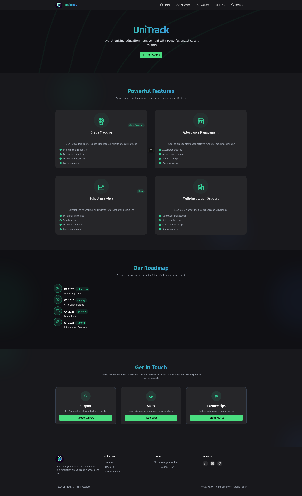
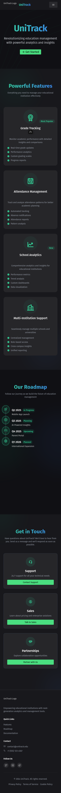
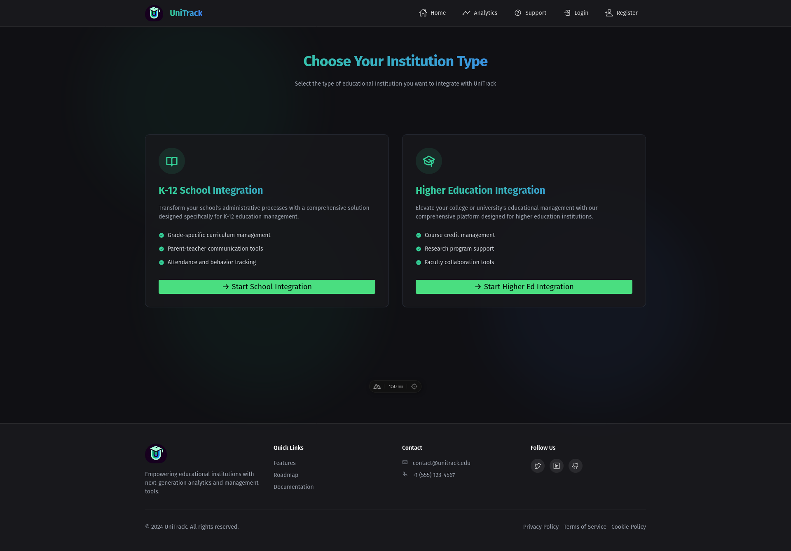
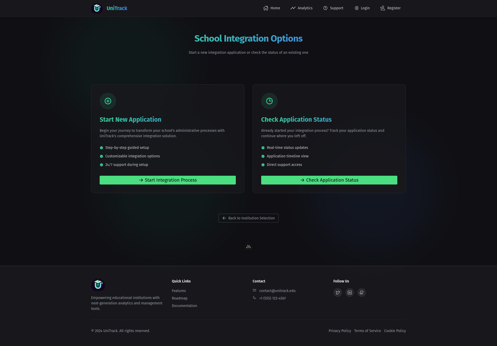
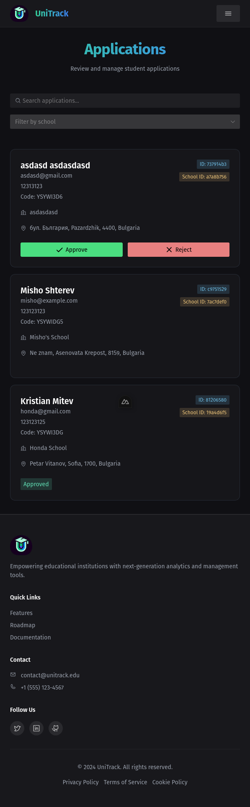
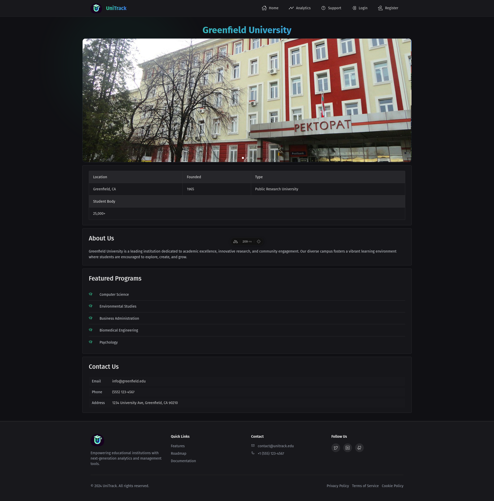
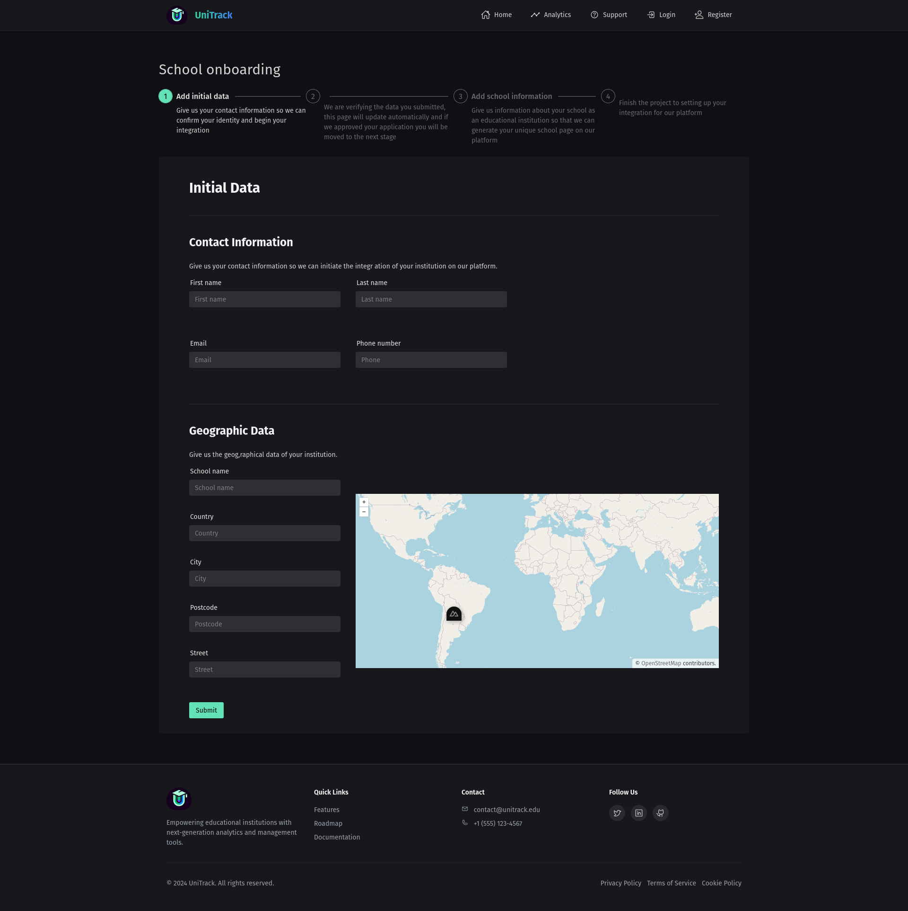
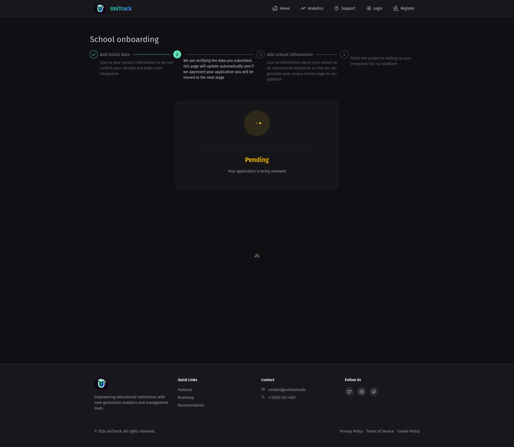
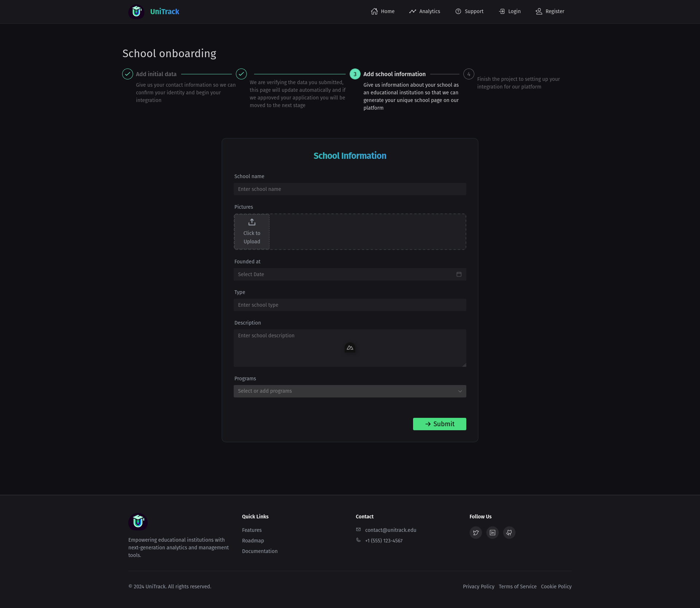
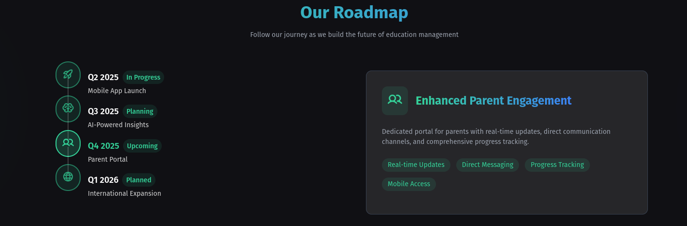

# UniTrackRemaster

UniTrackRemaster is the enhanced version of UniTrack, a full-stack application designed to streamline student and school management for educational institutions. The project aims to offer a responsive, user-friendly interface and a secure, scalable backend API.

## Table of Contents
1. [Project Overview](#project-overview)
2. [Features](#features)
3. [Frontend](#frontend)
4. [Backend](#backend)
5. [Setup and Installation](#setup-and-installation)
6. [Screenshots](#screenshots)
7. [Roadmap](#roadmap)
8. [Contributing](#contributing)

---

## Project Overview

**Frontend**: Built with Nuxt.js and Naive UI, styled with TailwindCSS for a modern and responsive interface.  
**Backend**: Powered by ASP.NET Core with PostgreSQL, designed to handle data efficiently while providing secure API endpoints.

UniTrackRemaster supports different user roles (e.g., Student, Teacher, Admin, Super Admin) and enables streamlined management of applications, school records, and user dashboards.

---

## Features

### Core Functionalities
- **Multi-Role Dashboards**: Dedicated views for students, teachers, parents, admins, and super admins. (in progress)
- **School Management**: Manage schools, view applications, and process approvals with intuitive UI and real-time data.
- **Onboarding Workflow**: Step-by-step onboarding for new institutions, with customizable options.
- **Calendar and Events**: Integrate calendars for school events and tracking. (planned)

### Future Enhancements
- **Multilingual Support**: Offer language options for a global audience.
- **Caching and Optimizations**: Speed up data retrieval and app performance.

---

## Frontend

The frontend is structured for scalability and ease of use:
- **Framework**: Nuxt.js and Naive UI
- **Styling**: TailwindCSS
- **State Management**: Pinia

### Display

- **Landing Page**  
  
  - Introduction to the platform, showcasing essential features and call-to-action buttons.

- **Mobile View**  
  
  - Fully responsive interface, optimized for mobile devices for on-the-go accessibility.

- **Onboarding Process**  
  
  - Step 1: Select the institution type, allowing tailored onboarding options.
  
  
  - Step 2: Configure additional options, providing a smooth setup experience.

  
  - Step 3: Set school-specific options, ensuring all necessary data is collected accurately.

---

## Backend

The backend API provides CRUD operations for different user roles, authorization via JWT, and reliable data validation:
- **Framework**: ASP.NET Core for robust API performance and security.
- **Database**: PostgreSQL, ensuring data consistency and efficiency.
- **Authentication & Authorization**: JWT-based user authentication for secure access control.


### Additional Backend Functionalities
- **School Creation and Management**: Create, read, update, and delete school entities.
- **User Role Management**: CRUD operations for Students, Teachers, Admins, and Super Admins. (in progress)
- **File Uploads**: Integrated with Firebase for seamless media management.
- **PDF Report Generation**: Server-side rendering of reports for easy sharing and documentation. (planned)

### Display

- **Admin and Super Admin Dashboards**  
  
  - Dedicated admin tools for managing users, schools, and applications.

- **School Applications**  
  
  - A comprehensive view of school applications, allowing admins to review and approve applications.

- **School Pages and Stepper Navigation**  
  
  - Detailed school page with navigation and options for managing each school profile.

  - **Onboarding Steps**  
      
      
      
      
  - Guides users through a seamless step-by-step onboarding process.

---

## Setup and Installation

### Prerequisites
- **Node.js** and **Nuxt.js** for the frontend
- **ASP.NET Core** and **PostgreSQL** for the backend
- **Docker** for containerized deployment

### Installation

1. Clone the repository:
   ```bash
   git clone https://github.com/your-repo/untrack-remaster.git
   cd untrack-remaster
   ```

2. **Frontend**: Navigate to the frontend directory and install dependencies.
   ```bash
   cd frontend
   npm install
   npm run dev
   ```

3. **Backend**: Set up the ASP.NET app
    
    The app requires an appsettings.json in the following format
```json
{
  "Logging": {
    "LogLevel": {
      "Default": "Information",
      "Microsoft.AspNetCore": "Warning"
    }
  },
  "ConnectionStrings": {
    "Database": "Host=; Port=; Database=; Username=; Password="
  },
  "Jwt": {
    "Key": "",
    "Issuer": "",
    "Audience": ""
  },
  "Smtp": {
    "EmailHost": "",
    "EmailUsername": "",
    "EmailPassword": ""
  }, 
  "FirebaseCredentials": {
    "CredentialsPath": "",
    "BucketPath": ""
  },
  "AllowedHosts": "*"
}
```
---

## Roadmap



### Frontend Phases
- **Current Phase**: Integration with backend for dashboards.
- **Upcoming**: Testing and performance optimizations, reducing payload size

### Backend Phases
- **Current Phase**: Finalize CRUD operations and enhance validation.
- **Upcoming**: Testing with xUnit, error handling, and deployment optimizations.

---


UniTrackRemaster is currently just my pet project and nothing to serious. It would be wonderful if it actually saw any use, but for now I use it as a way to hone my web dev skills. If you made it to here you showed at least some interest in the repo, thank you!